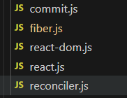

## mini-react (基于react17)  
### 拆分未以下几个模块：


### 大致的执行流程 


- 输入 jsx => react/jsx-runtime（babel） => React.element

- react-dom 中暴露render函数，render函数 =》调用fiber中暴露的createRoot方法 => 创建根节点 workInProgressRoot，作为首个 nextUnitOfWork；

### 函数作用
- `renderDom(workInProgress.element)` : 将React.element渲染为真实dom (stateNode)

- `reconcileChildren(workInProgress,element)`,对比（diff）新旧fiber,添加副作用标签；


- `workLoop`  处理循环和中断的逻辑，
workLoop 中执行 performUnitOfWork（当存在工作单元nextUnitOfWork时）， 
通过requestIdleCallback在空闲时间执行；在执行完所有工作单元即（!nextUnitOfWork&& workInProgressRoot）进入commit阶段执行`commitRoot`函数，这样能保证ui的变更是一次性的同步的不中断的；

- `performUnitOfWork（workInProgress）` 中会调用 renderDom、reconcileChildren；

- `commitRoot(rootFiber)`,从根节点开始 commit,先遍历(commitWork)deletions中的节点进行删除操作(Deletion),再深度优先遍历，先遍历child,后遍历sibling,执行插入(Placement)、更新(Update)操作;
- `commitWork`,递归执行 commit，此过程不中断,更新ui;


### 实现React.Component：

```js
//接收props
export class Component {
    constructor(props) {
        this.props = props;
    }
}
//标识
Component.prototype.isReactComponent = true;
//实现setState
Component.prototype.setState = function (param) {
  if (typeof param === 'function') {
    const result = param(this.state, this.props);
    this.state = {
      ...this.state,
      ...result,
    };
  } else {
    this.state = {
      ...this.state,
      ...param,
    };
  }
 //触发渲染
  commitRender();
};

//更新props
Component.prototype._UpdateProps = function (props) {
  this.props = props;
};

//触发渲染 => 其实就是指定nextUnitOfWork 
export function commitRender() {
    workInProgressRoot = {
        stateNode: currentRoot.stateNode,
        element: currentRoot.element,
        alternate: currentRoot
    }
    nextUnitOfWork = workInProgressRoot;
}

//同时performUnitOfWork函数中类组件迭代的逻辑抽离出来 => updateClassComponent
function performUnitOfWork(workInProgress){
    ...
    let type = workInProgress.element?.type;
    if(typeof type === 'function'){
        // 当前 fiber 对应 React 组件时，对其 return 迭代
        if(type.prototype.isReactComponent){
            //类组件
            updateClassComponent(workInProgress)
        }else{
            //函数组件
              updateFunctionComponent(workInProgress)
        }
    }

function updateClassComponent(fiber) {
  let jsx;
  if (fiber.alternate) {
    // 有旧组件，复用
    const component = fiber.alternate.component;
    fiber.component = component;
    component._UpdateProps(fiber.element.props);
    jsx = component.render();
  } else {
    // 没有则创建新组件
    const { props, type: Comp } = fiber.element;
    const component = new Comp(props);
    fiber.component = component;
    jsx = component.render();
  }

  reconcileChildren(fiber, [jsx]);
}
```

### 实现一下函数组件的 hooks:

```js
//新增全局变量（fiber.js）:
let currentFunctionFiber = null; // 当前正在执行的函数组件对应 fiber
let hookIndex = 0; //  当前正在执行的函数组件 hook 的下标

// 获取当前的执行的函数组件对应的 fiber
export function getCurrentFunctionFiber() {
  return currentFunctionFiber;
}

// 获取当前 hook 下标
export function getHookIndex() {
  return hookIndex++;
}


// 函数组件的更新
function updateFunctionComponent(fiber) {
  currentFunctionFiber = fiber;
  currentFunctionFiber.hooks = [];
  hookIndex = 0;
  const { props, type: Fn } = fiber.element;
  const jsx = Fn(props);
  reconcileChildren(fiber, [jsx]);
}

export function useState(initial) {
  const currentFunctionFiber = getCurrentFunctionFiber();
  const hookIndex = getHookIndex();
  // 取当前执行的函数组件之前的 hook
  const oldHook = currentFunctionFiber?.alternate?.hooks?.[hookIndex];

  // oldHook存在，取之前的值，否则取现在的值
  const hook = {
    state: oldHook ? oldHook.state : initial,
    queue: [], // 一次函数执行过程中可能调用多次 setState，将其放进队列一并执行
  };

  const actions = oldHook ? oldHook.queue : [];
  actions.forEach((action) => {
    hook.state = action(hook.state);
  });

  const setState = (action) => {
    if (typeof action === 'function') {
      hook.queue.push(action);
    } else {
      hook.queue.push(() => {
        return action;
      });
    }
    commitRender();
  };
  currentFunctionFiber.hooks.push(hook);
  return [hook.state, setState];
}

```

